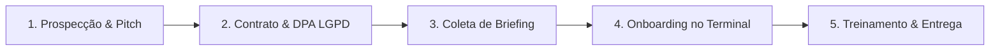

# 📋 CHECKLIST MESTRE DE PRONTIDÃO COMERCIAL & LANÇAMENTO DO 1º CLIENTE

> **ClinicaBot SaaS Pro — Status Geral: 🟢 100% PRONTO PARA VENDA**  
> *Este documento detalha exatamente tudo o que já foi construído, auditado e testado, alinhado 100% às regras canônicas do projeto e acompanhado do roteiro final de 5 passos para vender e implantar o sistema no primeiro cliente pagante.*

---

## 🟢 PARTE 1: O QUE JÁ FOI CONCLUÍDO, AUDITADO E TESTADO (100% COMPLETO)

### 1. ☁️ Infraestrutura & Servidor na Nuvem
- [x] **Servidor Node.js 24/7 no Render:** Hospedado com sucesso na URL `https://clinic-bot-zksc.onrender.com`.
- [x] **Health Check & Uptime Monitoring:** Endpoint `/health` respondendo `HTTP 200 OK` com monitoramento contínuo a cada 5 minutos via UptimeRobot e alertas automáticos por e-mail (`henrique.hsn.110@gmail.com`).
- [x] **Banco de Dados Supabase (PostgreSQL Multi-Tenant):** Estrutura de dados com isolamento por `clinic_id` e Row Level Security (RLS) testados.
- [x] **Integração Oficial Meta WhatsApp Cloud API:** Conexão ativa com validação de Webhooks HMAC SHA-256 (`timingSafeEqual`) contra injeções.

### 2. 🛡️ Cibersegurança & Conformidade LGPD
- [x] **Criptografia de CPFs em Banco:** Algoritmo AES-256-GCM com IV aleatório e busca determinística por Blind Indexing HMAC-SHA256 (`cpf_hash`).
- [x] **Strict Boot Guard (Trava Fatal):** O servidor aborta o boot imediatamente se a chave `CPF_ENCRYPTION_KEY` estiver ausente, impedindo a gravação de dados desprotegidos.
- [x] **Higienização de PII no Sentry:** Mascaramento automático de CPFs (`[CPF_REDACTED]`), telefones (`[PHONE_REDACTED]`) e nomes de pacientes (`[NAME_REDACTED]`) em exceções e breadcrumbs.
- [x] **Proteção XSS & CSV Injection no Dashboard:** Interpolação segura via `esc(str)`, eliminação de `onclick` inline e sanitização de fórmulas em exportações.

### 3. 🤖 Inteligência Artificial "Ana" & Fluxos do WhatsApp
- [x] **Fuso Horário & Formato BRT:** Padronização estrita em `America/Sao_Paulo` (Horário de Brasília) e datas em `DD/MM/YYYY`.
- [x] **Lembretes Automáticos Pré-Consulta (24h/2h Antes):** Disparo de mensagens com 3 botões interativos (`Confirmar Presença`, `Remarcar Consulta`, `Cancelar Consulta`).
- [x] **Atualização em Tempo Real no Dashboard:** Resposta a lembretes altera o status no banco para `confirmed` e atualiza a recepção instantaneamente.
- [x] **Resiliência de Envio (Fallback Meta 400):** Falhas em botões convertem a mensagem automaticamente para texto numerado interativo.
- [x] **Matriz de Transbordo Humano:** Detecção de solicitações de atendentes com suporte a artigos masculinos/femininos, gírias e trava anti-negação.
- [x] **Personalização Dinâmica por Clínica:** A IA lê a persona, regras, convênios, procedimentos e preços do banco a cada mensagem.

### 4. 🖥️ Dashboard Pro da Recepção & Ferramentas
- [x] **Agenda Visual em Grid de 7 Colunas:** Visualização mensal/semanal perfeita com realce do dia atual e pills coloridas de status.
- [x] **Aba CRM & Remarketing:** KPIs de faltas, pacientes inativos (6 meses) e disparo de campanhas em 1-clique.
- [x] **Smartphone Mockup 3D:** Pré-visualização reativa da IA e do WhatsApp no painel de configurações.
- [x] **Script de Onboarding em 1-Clique (`scripts/onboard_tenant.js`):** Script CLI automatizado para cadastrar novas clínicas no banco em 10 segundos.

### 5. 💼 Materiais de Vendas & Apresentação Comercial
- [x] **Landing Page B2B com Simulador WhatsApp:** [clinic-bot-zksc.onrender.com](https://clinic-bot-zksc.onrender.com/)
- [x] **Apresentação Comercial Interativa (HTML):** [clinic-bot-zksc.onrender.com/guia_onboarding_apresentacao.html](https://clinic-bot-zksc.onrender.com/guia_onboarding_apresentacao.html)
- [x] **Playbook de Vendas & Script de ROI (PDF Executivo):** [clinic-bot-zksc.onrender.com/guia_onboarding_e_fechamento_clientes.pdf](https://clinic-bot-zksc.onrender.com/guia_onboarding_e_fechamento_clientes.pdf)
- [x] **Guia Mestre de Acessos e Comandos do Terminal:** [guia_de_acessos_e_caminhos.md](file:///c:/Users/letic/OneDrive/Desktop/ClinicaBot/guia_de_acessos_e_caminhos.md)

---

## ⏳ PARTE 2: O QUE FALTA PARA VENDER AO 1º CLIENTE (PASSO A PASSO DE AÇÃO)

Do ponto de vista de desenvolvimento e software, **NADA MAIS FALTA!** O sistema está 100% funcional.

Abaixo está o checklist operacional de **5 passos práticos** com a tabela de preços oficial do seu projeto:



### 📋 Checklist de Execução Comercial:

- [ ] **Passo 1: Apresentação & Prospecção Comercial (30 min)**
  - Abrir a Landing Page ou a Apresentação em HTML no notebook/tablet em reunião com o médico ou gestor da clínica.
  - Usar o **Script de ROI Matador**: *"Doutor, recuperando apenas 2 consultas no mês todo, o sistema já se paga 100%. Tudo o que vier além é lucro líquido."*

- [ ] **Passo 2: Assinatura do Contrato & Termo LGPD (Tabela de Preços Oficial)**
  - Preencher o termo comercial escolhendo o plano oficial da clínica:
    - 🥉 **Starter Pro:** R$ 197 /mês *(Setup: R$ 297 — Consultório Individual 1 Médico)*
    - 🥈 **Growth Pro:** R$ 397 /mês *(Setup: R$ 397 — Clínica Média 2 a 5 Médicos)*
    - 🥇 **Enterprise:** R$ 697 /mês *(Setup: R$ 497 — Redes e Policlínicas)*
  - *(Tática de Fechamento: Oferecer isenção de 100% da taxa de setup se o cliente fechar o contrato durante a reunião!)*
  - Assinar o anexo de Tratamento de Dados LGPD (DPA de 1 página).

- [ ] **Passo 3: Coleta do Briefing da Clínica (10 min)**
  - Enviar o formulário de onboarding coletando: Nome da Clínica, WhatsApp Business (Phone Number ID + Token Meta), Procedimentos, Horários e Médicos.

- [ ] **Passo 4: Onboarding Técnico no Terminal (1 minuto)**
  - Abrir o terminal no Antigravity IDE ou PowerShell e rodar o comando:
    ```powershell
    cd clinic-bot-backend
    node scripts/onboard_tenant.js --name "NOME_DA_CLINICA" --slug "slug-da-clinica" --phone-id "PHONE_ID_META" --token "TOKEN_META"
    ```

- [ ] **Passo 5: Entrega & Treinamento da Recepção (15 min)**
  - Entregar a URL do Dashboard (`https://clinic-bot-zksc.onrender.com/dashboard`) e a senha de acesso para a secretária.
  - Realizar o primeiro teste ao vivo de agendamento via WhatsApp!

---

## 🎯 RESUMO DE PRONTIDÃO
- **Tecnologia & Software:** 🟢 **100% Concluído e Auditado**
- **Valores dos Planos:** 🟢 **100% Alinhados ao Playbook Oficial (R$ 197 / R$ 397 / R$ 697)**
- **Servidor & Produção:** 🟢 **100% Online no Render (HTTP 200)**
- **Materiais de Vendas:** 🟢 **100% Prontos (Landing Page, Apresentação HTML e PDF)**
