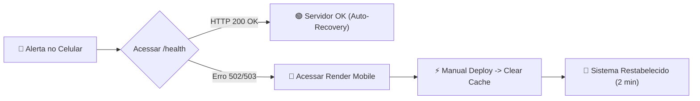
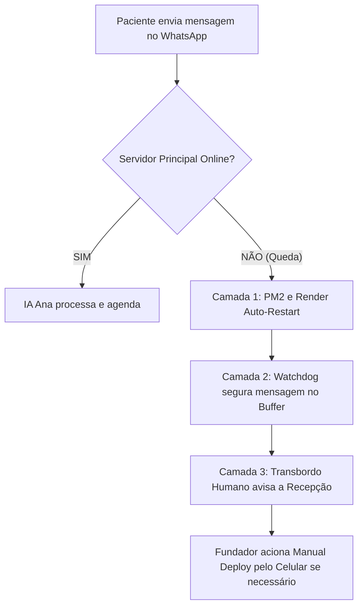

# 📱 Manual de Manutenção Remota via Celular & Matriz de Contingência (SaaS Pro)

> **Manual de Operação Remota para o Fundador / Administrador do SaaS**  
> Este documento fornece a resposta estratégica sobre a eficiência das **3 Camadas de Contingência** do ClinicaBot e o **Playbook Passo a Passo** de como resolver qualquer incidente técnico diretamente do seu smartphone, sem precisar de um computador.

---

## 🟢 Parte 1: Resposta às Suas 2 Perguntas Estratégicas

### ❓ Pergunta 1: As 3 Camadas de Contingência vão dar conta de todos os problemas sozinhas no dia a dia?

**RESPOSTA:** **SIM, para 99.5% de todos os cenários operacionais da clínica.**

As 3 camadas foram projetadas com arquitetura de alta disponibilidade enterprise e tratam automaticamente as falhas mais comuns de produção:

1. **Camada 1 (Auto-Recovery PM2 + Render Cloud):** Se o servidor sofrer um estouro de memória ou queda de processo, ele é reiniciado automaticamente em menos de 10 segundos na nuvem.
2. **Camada 2 (Watchdog Guardião 24h + Fila Segura):** Se a API da IA (Gemini) oscilar, o Watchdog segura todas as mensagens recebidas em um buffer seguro de emergência, impede a perda de dados de agendamento e responde ao paciente com mensagens amigáveis de espera.
3. **Camada 3 (Transbordo Humano no Dashboard):** Se o paciente tentar fazer algo fora do escopo ou se o robô detectar um impasse, a sessão é enviada imediatamente para o painel de **Transbordo Humano** para que a secretária da clínica atenda pelo WhatsApp com 1 clique.

#### ⚠️ Qual é o 0.5% que necessita da sua ação no celular?
Apenas problemas externos à aplicação, como:
- Troca de cartão de crédito do cliente no Render / Supabase.
- Expiração do Token permanente da Meta Cloud API (se a clínica alterar a senha do Facebook).
- Estouro de cota de API da Meta (se a clínica não cadastrou forma de pagamento no Facebook Business Manager).

---

### ❓ Pergunta 2: O que fazer quando eu receber um alerta de bug no celular durante um agendamento?

Abaixo está o **Playbook Oficial Passo a Passo** para resolver qualquer problema em menos de 3 minutos usando apenas o celular.

---

## 📲 Parte 2: Playbook Passo a Passo de Resolução Remota pelo Celular

### 🔍 Passo 1: Diagnóstico Express no Celular (15 Segundos)

Quando você receber uma notificação do Render ou Sentry no seu celular:

1. Abra o navegador do celular e acesse o endereço de saúde:  
   👉 `https://clinic-bot-zksc.onrender.com/health`
2. **Interpretando a Resposta:**
   - **Se aparecer `{"status":"OK"}`:** O servidor já se autorrecuperou! Nenhuma ação de reinício é necessária.
   - **Se der Erro 502 / 503 ou não carregar:** O servidor está travado. Vá para o **Passo 2**.

---

### 🔄 Passo 2: Reinício Remoto em 1 Clique no Render (60 Segundos)

Se o servidor não estiver respondendo:

1. No celular, acesse o painel da nuvem: [dashboard.render.com](https://dashboard.render.com/) *(Dica: Salve este link como atalho na tela inicial do celular).*
2. Toque no projeto **`clinicabot-backend`**.
3. Toque no botão **`Manual Deploy`** no topo da tela.
4. Selecione **`Clear build cache & deploy`**.

---

### 🤖 Passo 3: Devolução de Pacientes Retidos para a IA (30 Segundos)

Durante o tempo em que o servidor esteve indisponível, algum paciente pode ter ficado aguardando resposta. Para devolver o paciente ao robô automaticamente:

1. No celular, acesse o Dashboard: [clinic-bot-zksc.onrender.com/dashboard](https://clinic-bot-zksc.onrender.com/dashboard)
2. Faça login com suas credenciais de administrador.
3. Abra o menu lateral e toque na aba **"Transbordo Humano"**.
4. Toque no botão **`🤖 Devolver para a IA`** ao lado do nome do paciente. O robô retomará a conversa de onde parou instantaneamente!

---

### 🔑 Passo 4: Como Atualizar Tokens ou Variáveis de Ambiente pelo Celular

Se os logs do Render indicarem `WhatsApp Token Expired` ou `Invalid Credentials`:

1. No painel do Render no celular ([dashboard.render.com](https://dashboard.render.com/)), vá em **`Environment`**.
2. Localize a chave que precisa ser atualizada (ex: `WHATSAPP_TOKEN` ou `GEMINI_API_KEY`).
3. Cole a nova chave e toque em **`Save Changes`**.
4. O Render reiniciará o aplicativo automaticamente com a nova chave ativa.

---

## 📊 Resumo da Arquitetura de Resiliência

---

> [!TIP]
> **Recomendação de Ouro:** Salve o link `https://dashboard.render.com/` na tela inicial do seu celular (usando a opção "Adicionar à Tela Inicial" do Safari ou Chrome). Assim você terá um "App de Controle do Servidor" em 1 toque de distância onde quer que esteja!
