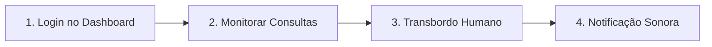

# 🚀 Playbook Completo & Definitivo de Implantação SaaS — ClinicaBot SaaS Pro

> **Manual Master de Operações, Vendas, Inteligência Competitiva e Gestão Multi-Tenant**  
> Guia passo a passo exaustivo para prospecção, fechamento de contratos, onboarding técnico, configuração de IA, treinamento de equipe e retenção pós-venda.

---

## 📑 Sumário Executivo

- **Módulo 1: Inteligência Competitiva & Estratégia Comercial**
  - *1.1 Mapeamento da Concorrência (Cloudia, Doctoralia, TuoTempo)*
  - *1.2 Os 5 Pilares Imbatíveis do ClinicaBot SaaS Pro*
  - *1.3 Calculadora de Retorno Financeiro (Arma de Venda)*
  - *1.4 Tabela de Precificação SaaS & Tática de Fechamento*
  - *1.5 Matriz de Quebra de Objeções*
- **Módulo 2: Formulário Oficial de Briefing & Coleta de Dados**
- **Módulo 3: Guia Passo a Passo de Implantação Técnica (SLA 24h)**
  - *Etapa 3.1: Configuração do WhatsApp Oficial Meta Cloud API*
  - *Etapa 3.2: Cadastro do Tenant no Supabase (`scripts/add_new_clinic.js`)*
  - *Etapa 3.3: Configuração das Regras, Persona e Corpo Clínico no Dashboard SaaS*
- **Módulo 4: Roteiro de Treinamento da Recepcionista & Operações**
- **Módulo 5: Pós-Venda, Relatórios CRM & Retenção de Clientes**
- **Módulo 6: Checklist de Qualidade & Auditoria Pré-Entrega**

---

## Módulo 1: Inteligência Competitiva & Estratégia Comercial

### 1.1 Mapeamento da Concorrência no Brasil (Cloudia, Doctoralia, TuoTempo)

Para garantir taxa de conversão acima de 40% nas reuniões de apresentação, o seu pitch deve explorar as fragilidades dos grandes concorrentes de mercado:

* **Cloudia:** Muito forte em clínicas odontológicas. **Pontos fracos:** Cobra taxa de implantação elevada, exige formulários longos e possui suporte demorado.
* **Doctoralia / TuoTempo:** Domina grandes clínicas e hospitais. **Pontos fracos:** Custo altíssimo por médico, implementação lenta (levar semanas) e interface complexa que assusta recepcionistas.
* **Plataformas Genéricas de WhatsApp (Zello, Chatpro):** Não possuem inteligência odontológica nem fluxos clínicos de CRM (como retorno de 6 meses e recuperação de faltosos).

---

### 1.2 Os 5 Pilares Imbatíveis do ClinicaBot SaaS Pro

1. **SLA de Implantação em 24 Horas:** Enquanto concorrentes levam semanas, o ClinicaBot é ativado e treinado na clínica em até 24h.
2. **Zero Atrito de Migração ("Sidecar" do ERP Atual):** A clínica **não precisa trocar o sistema dela** (Simples Dental, Clinicorp, Dental Office). O ClinicaBot atua como o atendente de elite do WhatsApp que entrega os agendamentos prontos.
3. **Atendimento 24/7 sem Perda de Pacientes:** 68% das dúvidas surgem fora do horário comercial. A IA responde em segundos no Horário de Brasília.
4. **Citação Nominal dos Médicos & Procedimentos:** A IA "Ana" identifica o profissional associado à consulta (ex: *Dr. Carlos Eduardo*, *Dra. Juliana Mendes*) e tira dúvidas de tratamentos com precisão.
5. **Privacidade & Segurança LGPD:** Criptografia AES-256 e mascaramento automático de CPF (`cpfMasked`).

---

### 1.3 Calculadora de Retorno Financeiro (Fórmula Matadora na Reunião)

Durante a apresentação para o médico, use esta fórmula para provar que a ferramenta é **gratuita** na prática:

> 💡 **Script Comercial de Retorno Financeiro:**  
> *"Doutor, no Brasil, a taxa de faltas sem aviso prévio (no-show) em clínicas particulares gira entre 20% e 35%. Se a sua clínica realizar 200 consultas no mês a R$ 250 cada com 25% de faltas, você está deixando de faturar **R$ 12.500 por mês**.*  
> *Com o ClinicaBot enviando lembretes duplos com confirmação em 1 clique (24h e 2h antes), recuperamos 75% dessas faltas, colocando **R$ 9.375,00 por mês de volta no seu caixa**.*  
> *Se o ClinicaBot recuperar **APENAS 2 CONSULTAS no mês todo**, o sistema **JÁ SE PAGOU 100%**! Tudo o que vier além disso é lucro líquido direto na sua conta."*

---

### 1.4 Tabela de Precificação SaaS & Tática de Fechamento

#### Estrutura de Planos Sugerida:

| Plano | Perfil da Clínica | Taxa de Implantação (Setup) | Mensalidade |
| :--- | :--- | :--- | :--- |
| **Starter Pro** | Consultório Individual (1 Médico) | R$ 297 | R$ 197 /mês |
| **Growth Pro** | Clínica Média (2 a 5 Médicos) | R$ 397 | R$ 397 /mês |
| **Enterprise** | Redes e Policlínicas (Ilimitado) | R$ 497 | R$ 697 /mês |

> 💥 **Gatilho de Fechamento Imediato na Reunião:**  
> *"Doutor, a nossa taxa de implantação e treinamento da equipe é de R$ 397. Porém, se fecharmos o contrato hoje durante a nossa reunião, eu **isento 100% a taxa de implantação** e você paga apenas a mensalidade!"*

> 🛡️ **Garantia Incondicional de Reversão de Risco (30 Dias):**  
> *"Oferecemos garantia incondicional de 30 dias. Se a IA não reduzir o tempo de resposta e aumentar os agendamentos no primeiro mês, devolvemos 100% do seu dinheiro."*

---

### 1.5 Matriz de Quebra de Objeções

| Objeção do Médico | Resposta Comercial Recomendada |
| :--- | :--- |
| **"Já tenho uma secretária que cuida do WhatsApp."** | *"Perfeito! O ClinicaBot não substitui a sua secretária, ele é o assistente virtual dela. Durante o dia, ele responde as perguntas repetitivas para ela focar no atendimento presencial. E quando ela vai embora às 18h, a IA continua agendando para a sua clínica o noite inteiro."* |
| **"E se a IA passar uma informação errada para o paciente?"** | *"Todas as regras (valores, convênios, horários) são cadastradas por você no Dashboard. Se o paciente fizer uma pergunta clínica complexa ou pedir um desconto especial, a IA transfere a conversa para a secretária na aba Transbordo Humano."* |
| **"Meus pacientes preferem atendimento humano."** | *"Os pacientes preferem velocidade. Ninguém quer esperar 2 horas por uma resposta simples de endereço ou preço. A IA Ana/Lara é extremamente cortês, usa emojis amigáveis e se apresenta como assistente da clínica."* |
| **"Tenho medo de ser difícil de mexer no sistema."** | *"O Dashboard foi desenhado para ser tão simples quanto usar o WhatsApp. Em um treinamento de 5 minutos a sua recepção já estará utilizando 100% das funções."* |

---

## Módulo 2: Formulário Oficial de Briefing & Coleta de Dados

Copie o texto abaixo e envie via WhatsApp para o responsável pela clínica assim que o contrato for assinado:

```text
📋 FORMULÁRIO DE IMPLANTAÇÃO — CLINICABOT SAAS PRO

Por favor, preencha os dados abaixo para configurarmos a Inteligência Artificial e o Painel do seu consultório:

1. DADOS DE CADASTRO DA CLÍNICA:
   • Nome Fantasia da Clínica: 
   • E-mail do Administrador (Será o login de acesso ao Dashboard): 
   • Telefone Fixo ou WhatsApp Comercial da Clínica: 
   • Endereço Completo (Rua, Número, Bairro, Cidade/UF e Ponto de Referência): 

2. CONFIGURAÇÃO DA ASSISTENTE VIRTUAL (IA):
   • Nome desejado para a IA (Ex: Lara, Bruna, Ana, Camila): 
   • Valor da Consulta de Avaliação Inicial (R$): 
   • Instrução de Urgência (Ex: "Em caso de dor forte, orientamos ligar imediatamente para o telefone X ou ir ao pronto-socorro"): 

3. REGRAS COMERCIAIS & HORÁRIOS:
   • Convênios / Planos de Saúde Aceitos (Separados por vírgula): 
   • Formas de Pagamento Aceitas na Recepção (Ex: PIX com 5% desc, Cartão em 12x): 
   • Dias e Horários de Atendimento (Ex: Segunda a Sexta, das 08h às 18h): 
   • Antecedência Mínima para Cancelamento (Ex: 4 horas antes): 

4. CORPO CLÍNICO & ESPECIALIDADES:
   • Nome dos Médicos/Dentistas, Especialidade e CRO/CRM:
     - Profissional 1: 
     - Profissional 2: 
     - Profissional 3: 
```

---

## Módulo 3: Guia Passo a Passo de Implantação Técnica (SLA 24h)

### Etapa 3.1: Configuração do WhatsApp Oficial (Meta Cloud API)

1. Acesse o portal [Meta for Developers](https://developers.facebook.com/) com a conta do Facebook Business da clínica.
2. Crie um aplicativo do tipo **Empresarial (Business)** e adicione o produto **WhatsApp**.
3. Em **Configuração do WhatsApp > API Setup**:
   - Adicione e verifique o número de telefone da clínica via código SMS ou chamada.
   - Copie o **Phone Number ID**.
   - Em *Configurações do Negócio > Usuários do Sistema*, crie um usuário do sistema com permissão `whatsapp_business_messaging` e gere o **Token de Acesso Permanente**.

---

### Etapa 3.2: Cadastro do Tenant no Supabase (`scripts/add_new_clinic.js`)

Abra o terminal do seu servidor backend e execute o script utilitário preenchendo os dados do formulário:

```bash
node scripts/add_new_clinic.js \
  "<NOME_DA_CLINICA>" \
  "<SLUG_UNICO>" \
  "<EMAIL_ADMIN>" \
  "<TELEFONE_WHATSAPP>" \
  "<NOME_DA_PERSONA>"
```

#### Exemplo Prático de Cadastro:
```bash
node scripts/add_new_clinic.js \
  "Clínica Odonto Riso" \
  "odonto-riso" \
  "admin@odontoriso.com.br" \
  "5511972008720" \
  "Bruna"
```

#### O que a automação realiza no banco de dados:
- Registra a clínica na tabela `clinics` e gera o UUID do Tenant (`id`).
- Aplica o isolamento estrito de registros via Supabase **Row Level Security (RLS)**.
- Inicializa o objeto de configurações em JSON na coluna `work_hours`.
- Retorna no console as credenciais provisórias de login prontas para envio.

---

### Etapa 3.3: Configuração das Regras, Persona e Corpo Clínico no Dashboard

1. Acesse o painel web: `https://clinic-bot-zksc.onrender.com/dashboard/`
2. Realize o login com o e-mail cadastrado (`admin@odontoriso.com.br`) e a senha provisória.
3. Navegue até a aba **Configurações da IA & WhatsApp**:
   - **Nome da Assistente Virtual:** Digite o nome escolhido (ex: *Bruna*).
   - **Endereço Completo:** Insira o texto formatado com ponto de referência.
   - **Valor da Avaliação (R$):** Insira o valor numérico (ex: `150`).
   - **Procedimentos & Tratamentos:** Digite os procedimentos separados por vírgula (ex: *Consulta Geral, Limpeza, Tratamento de Canal, Implantes, Clareamento*).
   - **Convênios Aceitos & Pagamentos:** Digite a lista de planos e regras de parcelamento.
   - **Horários & Regras de Cancelamento:** Selecione o período de atendimento (*Segunda a Sexta*) e antecedência mínima (*4 Horas antes*).
   - Clique no botão **"Salvar e Aplicar no WhatsApp da IA"**.
4. Navegue até a aba **Corpo Clínico & Médicos**:
   - Clique em **"+ Cadastrar Médico"** e adicione a escala dos profissionais (*Dr. Carlos Eduardo*, *Dra. Juliana Mendes*).
5. **Agendamento Manual na Recepção:**
   - Na aba *Agenda de Consultas*, ao clicar em **"+ Agendamento"**, o menu de procedimentos renderiza automaticamente com fundo escuro e texto branco totalmente legível em Dark Mode.

---

## Módulo 4: Roteiro de Treinamento da Recepcionista & Operações

Realize uma sessão de treinamento de 5 minutos com a secretária seguindo este roteiro:



1. **Acesso Diário:**
   - Salve o link `https://clinic-bot-zksc.onrender.com/dashboard/` nos favoritos do navegador do computador da recepção.
2. **Visualização da Agenda:**
   - Ensine a chavear entre a visão de **Tabela** e o **Calendário Visual** (Grid 7 Colunas).
   - Mostre como confirmar ou cancelar consultas nos botões **"✓ Confirmar"** ou **"✓ Cancelar"**. Explicar que a ação dispara notificação automática no WhatsApp do paciente.
3. **Atendimento Humano (Transbordo):**
   - Quando o paciente faz uma pergunta que exige intervenção da secretária, o chat é transferido para a aba **Transbordo Humano**.
   - A secretária clica em **"Atender no WhatsApp"** para conversar com o paciente.
   - Após resolver a dúvida, ela clica em **"Devolver para a IA"** para que o robô volte a responder automaticamente.
4. **Alerta Sonoro:**
   - Garanta que a opção **"Som Ativo"** (no topo do Dashboard) esteja ativada para emitir um sinal sonoro sempre que entrar um paciente aguardando atendimento.

---

## Módulo 5: Pós-Venda, Relatórios CRM & Retenção de Clientes

### 5.1 Campanhas de CRM & Remarketing no WhatsApp
Apresente à clínica as funcionalidades da aba **CRM & Remarketing** no Dashboard para gerar novas consultas sem gasto com anúncios:

- **Retorno Preventivo (6 Meses):** Disparo automático para pacientes que realizaram limpeza/avaliação há 6 meses.
- **Recuperação de Faltantes (No-Show):** Mensagem de reagendamento sem custo para pacientes que faltaram à consulta.
- **Cortesia de Aniversário:** Envio de mensagem comemorativa com cupom de desconto para aniversariantes do mês.

---

## Módulo 6: Checklist de Qualidade & Auditoria Pré-Entrega

Antes de realizar a entrega oficial dos acessos ao cliente, execute o checklist final de auditoria:

- [ ] **Teste de Boas-Vindas:** Enviar mensagem "Olá" no WhatsApp do cliente e confirmar que a IA se apresenta com o nome correto (ex: *"Olá! Sou a Bruna, assistente da Clínica Odonto Riso 😊"*).
- [ ] **Validação de Informações:** Perguntar à IA o endereço, o valor da consulta e o nome do médico responsável no WhatsApp para garantir que a IA responde nominalmente (ex: *"Dra. Juliana Mendes"*).
- [ ] **Teste de Agendamento:** Simular a marcação de uma consulta pelo WhatsApp e verificar se o registro aparece imediatamente na agenda do Dashboard.
- [ ] **Teste de Reagendamento / Limpeza:** Testar mudar de "Cancelar" para "Remarcar Consulta" e selecionar "Limpeza" garantindo que o rascunho de sessão reseta sem acionar cancelamentos indevidos.
- [ ] **Validação de Transbordo:** Simular o pedido *"Quero falar com a secretária"* e verificar se o alerta sonoro e o registro aparecem na aba Transbordo Humano.
- [ ] **Entrega de Credenciais:** Enviar o documento de boas-vindas contendo a URL do painel, login e senha do cliente.

---
*ClinicaBot SaaS Pro — Documentação Master de Implantação e Operações.*
